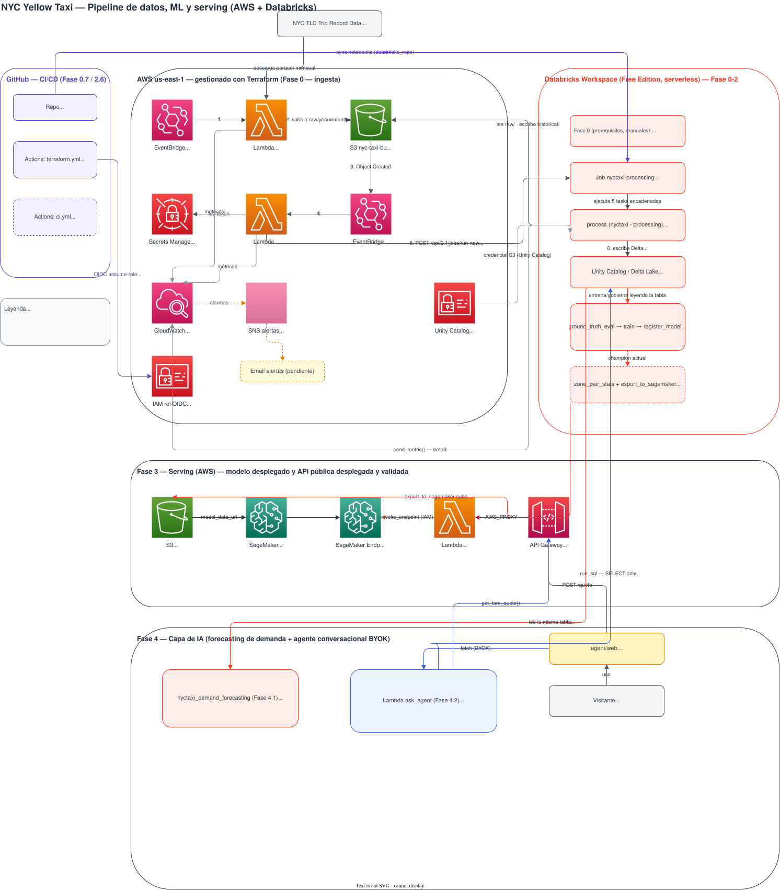

# NYC Yellow Taxi — Data Pipeline + ML + MLOps + Serving + Agente de IA

Proyecto e-2-e sobre **NYC Yellow Taxi** (TLC Trip Record Data), de punta a punta: ingesta mensual automatizada hacia S3, procesamiento y feature engineering en Databricks (Delta Lake + Unity Catalog), entrenamiento y gobierno del modelo de predicción de tarifa (MLOps con champion/challenger), serving en producción vía AWS SageMaker, forecasting de demanda, y un agente conversacional (BYOK) con frontend web público. Infraestructura como código con Terraform (providers `aws` + `databricks` en el mismo state).

**Demo en vivo:** [mmereles.github.io/DE-ML-AI---nyctaxi](https://mmereles.github.io/DE-ML-AI---nyctaxi/) — cotización instantánea sin costo, y un chat donde cada visitante usa su propia key de OpenAI.

## Arquitectura

Las 5 fases del roadmap, de ingesta a capa de IA — todas implementadas y desplegadas. Íconos reales de AWS/Databricks, agrupado por servicio (fuente editable: [`nyctaxi_architecture.drawio`](nyctaxi_architecture.drawio), para abrir en [app.diagrams.net](https://app.diagrams.net)):



**Fase 0** (ingesta + prerequisitos) → **Fase 1-2** (processing, ML, MLOps en Databricks) → **Fase 3** (serving en SageMaker + API pública) → **Fase 4.1** (forecasting de demanda) → **Fase 4.2** (agente conversacional BYOK + frontend web).

Todas las Lambdas publican métricas custom en CloudWatch (`NYCTaxiDownload`, `NYCTaxiProcessing`) con alarmas asociadas ante errores de ejecución.

## Componentes

### `lambda/`

- **`ingestion.py`** — cron mensual (EventBridge, día 5 08:00 UTC). Calcula el mes anterior, evita redescargar si el archivo ya existe en S3 (`head_object`), descarga desde el CloudFront de TLC (`d37ci6vzurychx.cloudfront.net`) y sube a `s3://<bucket>/nyctaxi/raw/year=YYYY/month=MM/`. Reintenta hasta 3 veces, reporta duración/tamaño/throughput a CloudWatch.
- **`processing_trigger.py`** — disparado por EventBridge ante un objeto nuevo bajo `nyctaxi/raw/`. Extrae `year`/`month` del key, obtiene el token de Databricks desde Secrets Manager y llama `POST /api/2.1/jobs/run-now` para lanzar el job de Databricks.
- **`quote_api.py`** (Fase 3) — Lambda detrás de API Gateway: valida el pedido público (`pickup_zone`, `dropoff_zone`, `pickup_datetime`, `passenger_count`), lo traduce al formato que espera `sagemaker/inference.py`, y llama al endpoint de SageMaker vía `sagemaker-runtime.invoke_endpoint` (IAM, sin token/secreto). Sin costo ni key para el visitante — la usa tanto el formulario de `agent/web/` como la tool `get_fare_quote` del agente.
- **`requirements.txt`** — dependencias de `ingestion.py`/`processing_trigger.py`/`quote_api.py` (`requests`; `boto3` viene con el runtime). No se versionan las instaladas — se generan en build/deploy apuntando al runtime real de Lambda (ver sección Despliegue).

### `agent/` (Fase 4.2 — agente conversacional BYOK)

- **`backend/ask_agent.py`** — Lambda propia, detrás de una **Function URL** (no API Gateway: el timeout de integración de API Gateway tiene un techo duro de ~29s, insuficiente para un loop de tool-calling con varias vueltas; una Function URL solo está limitada por el timeout de la Lambda, hasta 900s). Recibe `{question, openai_api_key}`, corre un loop de tool-calling con OpenAI (`gpt-4o`) sobre dos herramientas: `run_sql` (SELECT-only contra Unity Catalog, catálogo/schema fijados en la conexión) y `get_fare_quote` (llama a `quote_api`, nunca inventa una tarifa). La key de OpenAI es del visitante — viaja en el request, nunca se guarda ni se loguea; las credenciales de Databricks quedan solo en variables de entorno del lado del servidor.
- **`web/`** — frontend React + Vite: formulario de cotización directo (sin key, sin costo) y un chat colapsable contra el agente. Desplegado a GitHub Pages vía GitHub Actions (`deploy-web.yml`) en cada push que toque esta carpeta; las URLs de los dos backends se inyectan en build time como variables de repo (`ASK_AGENT_URL`, `QUOTE_API_URL`), nunca hardcodeadas.

### `notebooks/` (mayormente formato `.py` de Databricks, sincronizados vía `databricks_repo`/Git Folder — `schema_audit` y `eda` siguen en `.ipynb`)

| Notebook | Fase | Qué hace |
|---|---|---|
| `nyctaxi - processing` | Pipeline base | Bronze → silver → gold: limpieza con reglas de calidad, ~20 features de ingeniería (flags de Manhattan/aeropuerto vía `taxi_zone_lookup`, que este notebook también persiste como tabla real de Unity Catalog), escritura idempotente a Delta (`replaceWhere` por partición) en `yellow_taxi_features`. |
| `nyctaxi_historical_processing_loop` | 0.1 | Corre después de `backfill.py`: llama a `nyctaxi - processing` una vez por cada mes bajo `nyctaxi/historical/` (prefix separado a propósito, no dispara el trigger automático), para que el histórico entre a `yellow_taxi_features` antes de entrenar. |
| `nyctaxi_schema_audit` | 0.5 | Lee solo el *schema* (no los datos) de cada mes del backfill y arma una matriz columna × mes, para detectar columnas que TLC agregó a mitad de camino (`congestion_surcharge`, `airport_fee`) antes de asumir un dataset homogéneo. |
| `nyctaxi_eda` | 0.6 | EDA manual sobre `yellow_taxi_features`: filas por mes, distribución del target, outliers que `clean_data` no filtra, nulls en las features pre-viaje — el último chequeo antes de entrenar. |
| `nyctaxi_fare_prediction_training` | 1 | Target = `total_amount − tip_amount`; solo features pre-viaje (sin leakage); split temporal; baseline naïve por par origen-destino; Ridge de referencia; XGBoost; tuning opcional; tracking completo en MLflow. Corrida de referencia: XGBoost supera al naïve por 26.3% de MAE. |
| `nyctaxi_register_model` | 2.1 | Busca el run `xgboost_default` más reciente en el experimento de MLflow, y si supera el umbral de mejora sobre el naïve, lo registra en Unity Catalog Model Registry (`nyc_taxi_analytics.fare_prediction.fare_model`) con alias `champion`. |
| `nyctaxi_ground_truth_eval` | 2.4 | Corre justo después de `process`, antes de re-entrenar: compara las predicciones que el champion actual hizo el mes pasado contra las tarifas reales que recién llegaron — "ground truth gratis" sin infraestructura de logging extra. |
| `nyctaxi_promote_champion` | 2.3 | Compara el challenger recién registrado contra el champion actual por `test_mae`; si gana, mueve el alias `champion` a la nueva versión. |
| `nyctaxi_zone_pair_stats` | 3.1 / 4.2 | Precomputa la mediana histórica de distancia/peajes/tarifa por cada par `(PULocationID, DOLocationID)` — el reemplazo de `trip_distance` (que no existe antes del viaje) para servir cotizaciones. Pares con <10 viajes se marcan `reliable=false`; además arma un fallback intermedio por par de *boroughs* (más representativo que el fallback global para pares de zonas periféricos con poca historia — el global venía dando tarifas negativas en esos casos). |
| `nyctaxi_export_to_sagemaker` | 3.4 | Empaqueta el champion (booster XGBoost en JSON) + `zone_pair_stats` (par exacto, por borough y global) + flags de zona + `sagemaker/inference.py` en un `model.tar.gz` con layout de Script Mode, y lo sube a S3 vía `dbutils.fs.cp` (el workspace es serverless, sin instance profile clásico). |
| `nyctaxi_demand_forecasting` | 4.1 | LightGBM sobre `yellow_taxi_features` agregado por zona/hora; genera `demand_forecast` (próximos 7 días) reutilizando el patrón de features en vez de forecasting recursivo real — documentado así a propósito, sin registro en Unity Catalog Model Registry (no se sirve como endpoint). |

### `sagemaker/`

- **`inference.py`** — código Script Mode para el contenedor oficial `sagemaker-xgboost:1.7-1`. Implementa el contrato de 4 funciones (`model_fn`, `input_fn`, `predict_fn`, `output_fn`): reconstruye las features de entrenamiento a partir del input mínimo (`PULocationID`, `DOLocationID`, `pickup_datetime`, `passenger_count`), estimando distancia con una cadena de fallback (par exacto confiable → mediana por borough → mediana global) y calculando flags de Manhattan/aeropuerto desde el lookup real de TLC. La predicción final se clampea a una tarifa mínima — ningún regressor de árboles tiene garantía de salida no negativa, y ninguna tarifa real de taxi lo es.
- **`requirements.txt`** — `pyarrow`, necesario para que `pd.read_parquet` funcione dentro del contenedor (no viene por defecto).

### `terraform/`

Infraestructura como código con dos providers en el mismo state (`aws` ~> 5.9, `databricks` ~> 1.55), región `us-east-1`:

- **`main.tf`** — bucket S3, Lambdas de ingesta/trigger, IAM, reglas de EventBridge, alarmas CloudWatch (sin `alarm_actions` todavía — falta SNS), secret de Databricks token.
- **`databricks.tf`** — credencial Git + `databricks_repo` (sincroniza este repo al workspace) + `databricks_job.processing`, el job con las 5 tasks encadenadas (`process → ground_truth_eval → train → register_model → promote_champion`), con `environment` serverless (sin cluster spec, este workspace es Free Edition).
- **`sagemaker.tf`** — rol IAM de ejecución (solo lee el artifact + logs), `aws_sagemaker_model` (el nombre incluye el ETag real del artefacto en S3, no un valor fijo — los Modelos de SageMaker son inmutables, así que cualquier redeploy necesita un nombre nuevo para poder reemplazar el recurso sin downtime), `aws_sagemaker_endpoint_configuration`/`aws_sagemaker_endpoint` (Serverless Inference, `create_before_destroy`).
- **`quote_api.tf`** (Fase 3) — API Gateway HTTP API (`POST /quote`) + integración Lambda + `cors_configuration` (sin esto, cualquier llamada desde el navegador falla en el preflight `OPTIONS`, aunque `curl` funcione bien).
- **`ask_agent.tf`** (Fase 4.2) — Lambda + Function URL (`authorization_type = "NONE"`, pública a propósito — la key de OpenAI la trae el visitante) + rol IAM acotado (solo logs + leer el secret de Databricks) + deploy vía S3 (el zip pesa ~60MB por las dependencias de `databricks-sql-connector`, por encima del límite de subida directa de Lambda).
- **`backend.tf`** — state remoto en S3 (`nyctaxi-tfstate-98741313131`), lock nativo (`use_lockfile`, sin DynamoDB).
- **`variables.tf`** / **`output.tf`** — `databricks_host`, `git_repo_url`, `model_version`, `sagemaker_xgboost_image`, `databricks_sql_warehouse_id`; outputs de ARNs/nombres/URLs de recursos clave.

### `backfill.py` (raíz)

Descarga N meses hacia atrás desde el CloudFront de TLC y los sube a `nyctaxi/historical/` — prefix separado a propósito de `nyctaxi/raw/` para no disparar el processing automático. Se procesa manualmente, una vez, con `nyctaxi_historical_processing_loop`.

### `tests/`

35 tests con `pytest` (`monkeypatch`/`MagicMock`, sin credenciales ni llamadas reales): las 3 Lambdas de `lambda/` y `sagemaker/inference.py` (incluye el fallback de distancia por borough y el clamp de tarifa mínima).

## Requisitos

- Cuenta AWS con permisos para los recursos de Terraform.
- Terraform >= 1.5.0 (subir a >= 1.10 si se usa el lock nativo de `backend.tf` con una versión anterior).
- Workspace de Databricks (Free Edition, serverless) con Unity Catalog habilitado.
- Personal Access Token de Databricks en Secrets Manager (`nyctaxi/databricks-token`), y el token del provider Terraform disponible como `DATABRICKS_TOKEN` al aplicar (no se hardcodea en ningún `.tf`).
- External Location de Unity Catalog cubriendo `s3://<bucket>/` (o al menos `/nyctaxi/` y `/sagemaker/`) para que los notebooks puedan leer/escribir en S3.
- Para el frontend (`agent/web/`): Node 20+, y en GitHub — Settings → Pages → Source = "GitHub Actions", más las variables de repo `ASK_AGENT_URL` y `QUOTE_API_URL` (outputs de `terraform apply`, no son secretas — el visitante las ve igual en el navegador).
- Para el chat del agente: cada visitante necesita su propia API key de OpenAI (BYOK) — el dueño del proyecto no paga ni expone su cuenta sin importar cuánta gente pruebe la demo.

## Despliegue

```bash
pip install \
  --platform manylinux2014_x86_64 \
  --implementation cp \
  --python-version 3.13 \
  --abi cp313 \
  --only-binary=:all: \
  --target lambda/ \
  -r lambda/requirements.txt

pip install \
  --platform manylinux2014_x86_64 \
  --implementation cp \
  --python-version 3.13 \
  --abi cp313 \
  --only-binary=:all: \
  --target agent/backend/ \
  -r agent/backend/requirements.txt

cd terraform
terraform init
terraform plan
terraform apply
```

> Las dependencias instaladas en `lambda/` y `agent/backend/` no se versionan en git (ver `.gitignore`) — se generan en cada build/deploy.

El frontend se despliega solo: cualquier push a `main` que toque `agent/web/**` dispara `.github/workflows/deploy-web.yml`, que compila con Vite y publica a GitHub Pages. `.github/workflows/terraform.yml` corre `plan` en cada PR que toque `terraform/`/`lambda/` y `apply` en cada push a `main` (rol OIDC, sin access keys guardadas en GitHub).

## Monitoreo

- **CloudWatch Logs**: `/aws/lambda/nyctaxi-data-ingestion`, `/aws/lambda/nyctaxi-processing-trigger`, `/aws/lambda/nyctaxi-quote-api`, `/aws/lambda/nyctaxi-ask-agent`, `/aws/sagemaker/Endpoints/nyctaxi-fare-quote`.
- **Métricas custom**: namespace `NYCTaxiDownload` (`JobSuccess`, `JobFailure`, `JobSkipped`, `DownloadDuration`, `UploadDuration`, `FileSize`, `FileSizeMB`, `DownloadThroughput`) y `NYCTaxiProcessing` (`JobTriggered`).
- **Alarmas**: `nyctaxi-ingestion-lambda-errors`, `nyctaxi-processing-lambda-errors` — se disparan ante errores no controlados, pero **sin destino configurado todavía** (ver abajo).

## Estado del proyecto

**Hecho y validado — las 5 fases completas y desplegadas:**
- [x] Ingesta mensual automatizada + trigger event-driven del processing.
- [x] Processing con feature engineering (~20 features) a Delta Lake / Unity Catalog.
- [x] Backfill histórico cargado y auditado (schema + EDA).
- [x] Fase 1 — modelo XGBoost, supera al baseline naïve por 26.3% de MAE.
- [x] Fase 2 — registry, retraining, ground truth loop y promoción champion/challenger, corriendo como job real de Databricks.
- [x] Fase 3 — API pública de cotización (`quote_api` + API Gateway) sobre el modelo servido en SageMaker (Serverless Inference).
- [x] Fase 4.1 — forecasting de demanda con LightGBM (`demand_forecast`).
- [x] Fase 4.2 — agente conversacional BYOK (Lambda Function URL, OpenAI tool-calling sobre `run_sql`/`get_fare_quote`) + frontend React desplegado en GitHub Pages.
- [x] Suite de 35 tests (`pytest`) sobre las Lambdas y `inference.py`.
- [x] CI/CD: `terraform.yml` (plan/apply vía OIDC) + `deploy-web.yml` (deploy automático del frontend).
- [x] Backend remoto de Terraform (S3 + lock nativo).

**Pendiente / deuda técnica conocida:**
- [ ] `alarm_actions` de CloudWatch sin destino — falta SNS + email.
- [ ] Lakehouse Monitoring sobre `yellow_taxi_features` (drift de features).
- [ ] `zone_pair_stats` / `export_to_sagemaker` siguen siendo pasos manuales en Databricks (no forman parte del job automático).
- [ ] `aws_s3_bucket_notification` sin declarar en Terraform — Unity Catalog la crea automáticamente sobre la External Location del bucket; no se toca en un `apply` de raíz para no borrarla por accidente.
